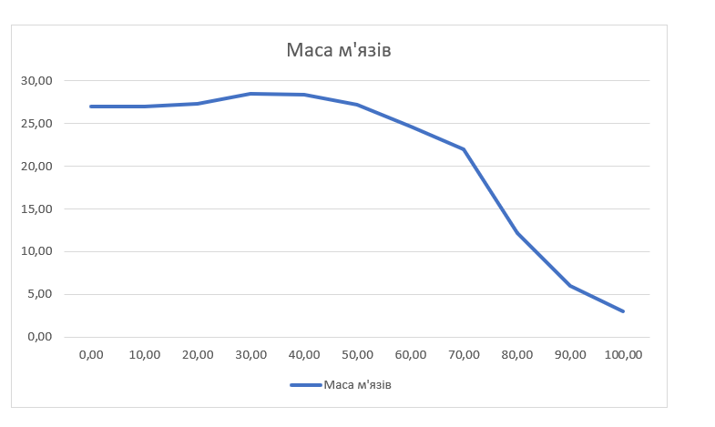
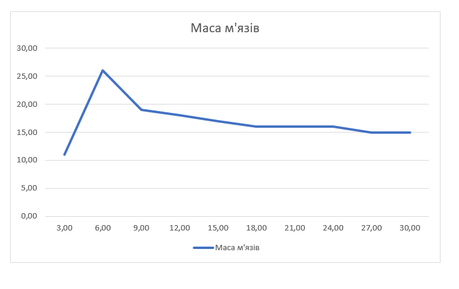
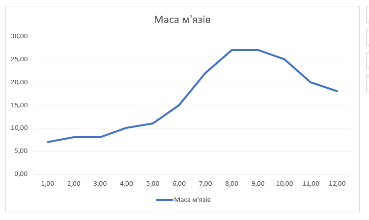

## Комп'ютерні системи імітаційного моделювання
## СПм-22-4, **Комаричев Андрій Валерійович**
### Лабораторна робота №**1**. Опис імітаційних моделей та проведення обчислювальних експериментів

 

### Варіант 12, модель у середовищі NetLogo:
[Muscle Development](http://www.netlogoweb.org/launch#http://www.netlogoweb.org/assets/modelslib/Sample%20Models/Biology/Muscle%20Development.nlogo)

 

### Вербальний опис моделі:
Це модель фізіології вправ. Вона покликана допомогти зрозуміти фактори, що беруть участь у створенні відповідного гормонального балансу для розвитку м'язів під час підняття тяжкості.Ці аспекти включають частоту тренувань, необхідність правильного відновлення, важливість якісного сну, інтенсивність тренувань, генетичні особливості (співвідношення повільних і швидких м'язових волокон). Взаємодія цих факторів є вирішальною для досягнення оптимального розвитку м'язової маси. 

### Керуючі параметри:
- **lift** - Цей параметр визначає, чи особа займається фізичними вправами, пов'язаними з підняттям ваг. Він є ключовим фактором у визначенні приросту м'язової маси.
- **intensity** - Це визначає, наскільки напружено працює людина в тренажерному залі. Чим вища інтенсивність тренувань, тим більше м'язових волокон втомлюється під час кожної сесії, сприяючи подальшому зміцненню і росту м'язів.
- **hours-of-sleep** - Цей параметр визначає кількість годин сну, яку людина отримує для відновлення м'язової тканини.. Від сна залежить відновлення органзіму, та відповідно наростання м’язів.
- **days-between-workouts** -Цей аспект визначає кількість днів, які пройдуть між тренуваннями. Частота тренувань впливає на те, скільки часу організм має для повного відновлення м'язової тканини.
- **%slow-twitch-fibers** - Цей параметр визначає відсоток м'язових волокон, які мають характеристики повільного скорочення. Це генетично визначений фактор, який впливає на витривалість та можливість розвитку м'язової маси.
  
### Внутрішні параметри:
- **fiber-size** - Цей параметр визначає фізичний розмір кожного окремого м'язового волокна.
- **anabolic** - Ці гормони сприяють відновленню м'язових волокон, сприяючи їхньому росту та розвитку.
- **catabolic** - Ці гормони руйнують м'язові волокна, що може впливати на їхню масу та стан.
- **hormone-diffuse-rate** - Цей параметр визначає, наскільки швидко гормони поширюються з одного м'язового волокна в інше. Це може впливати на рівновагу гормонального середовища для оптимального росту м'язів.
- **muscle-mass** - Цей аспект зберігає сумарний розмір м'язових волокон та враховує їхні зміни внаслідок різних фізіологічних чинників.
  
### Показники роботи системи:
- **Muscle Development** - графік маси м'язових волокон. 
- **Hormones** - графік виділення анаболітичних та катаболічних гормонів.
  
### Недоліки моделі:
В реальному житті часто виникають непередбачені обставини, які можуть порушити ретельно розроблений план тренувань або графік сну. Такі випадкові відхилення не враховуються в моделі, що визначає план тренувань. Наприклад, травми, непередбачені зміни у графіку роботи чи особистих обставинах можуть вплинути на здатність відпрацьовувати заплановані тренування.
Крім того, модель не враховує аспектів, таких як якість та частота харчування, які мають важливе значення для успішного розвитку м'язів. 

### Примітки:
- Перетренованість виникає, коли тілу не дають повністю відновитися після останнього сеансу вправ перед повторним тренуванням. Це викликає застій у розвитку м'язів, а в крайніх випадках - їх втрату

- Використання примітиву log в процедурах, які регулюють гормональний викид і баланс дозволяють точніше імітувати природну тенденцію кожної додаткової одиниці біологічного компонента викликати менші адаптивні зміни у системі, ніж попередні.
  
 

## Обчислювальні експерименти

### 1. Вплив відсотка м'язових волокон з повільним скороченням на ріст м'язів
Досліджується залежність росту м'язів протягом певної кількості тактів (200) від відсотка м'язових волокон з повільним скороченням.
Експерименти проводяться при 0-100 значення волокон, з кроком 10, усього 11 симуляцій.  
Інші керуючі параметри мають значення за замовчуванням:
- **intensity**: 95
- **hours-of-sleep**: 8
- **days-between-workouts**:5
- **lift**: on

<table>
<thead>
<tr><th>Відсоток м'язових волокон з повільним скороченням</th><th>Маса м'язів</th></tr>
</thead>
<tbody>
<tr><td>0</td><td>27</td></tr>
<tr><td>10</td><td>27</td></tr>
<tr><td>20</td><td>27,3</td></tr>
<tr><td>30</td><td>28,5</td></tr>
<tr><td>40</td><td>28,4</td></tr>
<tr><td>50</td><td>27,2</td></tr>
<tr><td>60</td><td>24,6</td></tr>
<tr><td>70</td><td>22</td></tr>
<tr><td>80</td><td>12,2</td></tr>
<tr><td>90</td><td>6</td></tr>
<tr><td>100</td><td>3</td></tr>
</tbody>
</table>

Результати показують, що оптимальний відсоток м'язових волокон з повільним скороченням для найбільшого росту м'язів знаходиться приблизно на рівні 30-40%. У цьому діапазоні спостерігається найбільше збільшення маси м'язів.

### 2. Вплив частоти тренувань на ріст м'язів
Досліджується залежність росту м'язів протягом певної кількості тактів (200) від частоти тренувань.
Експерименти проводяться при 3-30 днів між тренуваннями, з кроком 3, усього 10 симуляцій.  
Інші керуючі параметри мають значення за замовчуванням:
- **hours-of-sleep**: 8
- **lift**: on
- **intensity**: 95
- **%slow-twitch-fibers**: 50

<table>
<thead>
<tr><th>Частота тренувань</th><th>Маса м'язів</th></tr>
</thead>
<tbody>
<tr><td>3</td><td>11</td></tr>
<tr><td>6</td><td>26</td></tr>
<tr><td>9</td><td>19</td></tr>
<tr><td>12</td><td>18</td></tr>
<tr><td>15</td><td>17</td></tr>
<tr><td>18</td><td>16</td></tr>
<tr><td>21</td><td>16</td></tr>
<tr><td>24</td><td>16</td></tr>
<tr><td>27</td><td>16</td></tr>
<tr><td>30</td><td>15</td></tr>
</tbody>
</table>

З результатів видно, що оптимальна частота тренувань для максимального росту м'язів при цих умовах знаходиться в районі 6-9 днів між тренуваннями. У цьому діапазоні спостерігається найвища маса м'язів.

### 3. Вплив кількості годин сну на ріст м'язів.
Досліджується залежність росту м'язів протягом певної кількості тактів (200) від кількості годин сну.
Експерименти проводяться при 1-12 годин сну, з кроком 1, усього 12 симуляцій.  
Інші керуючі параметри мають значення за замовчуванням:
- **intensity**: 95
- **lift**: on
- **days-between-workouts**: 5
- **%slow-twitch-fibers**: 50

<table>
<thead>
<tr><th>Годин сну</th><th>Маса м'язів</th></tr>
</thead>
<tbody>
<tr><td>1</td><td>7</td></tr>
<tr><td>2</td><td>8</td></tr>
<tr><td>3</td><td>8</td></tr>
<tr><td>4</td><td>10</td></tr>
<tr><td>5</td><td>11</td></tr>
<tr><td>6</td><td>15</td></tr>
<tr><td>7</td><td>22</td></tr>
<tr><td>8</td><td>27</td></tr>
<tr><td>9</td><td>27</td></tr>
<tr><td>10</td><td>25</td></tr>
<tr><td>11</td><td>20</td></tr>
<tr><td>12</td><td>18</td></tr>
</tbody>
</table>

З результатів видно, що оптимальна кількість годин сну для максимального росту м'язів при цих умовах знаходиться в районі 8-9 годин. У цьому діапазоні спостерігається найвища маса м'язів.

 

